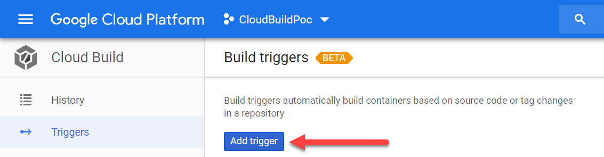
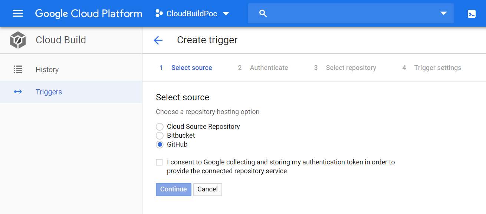
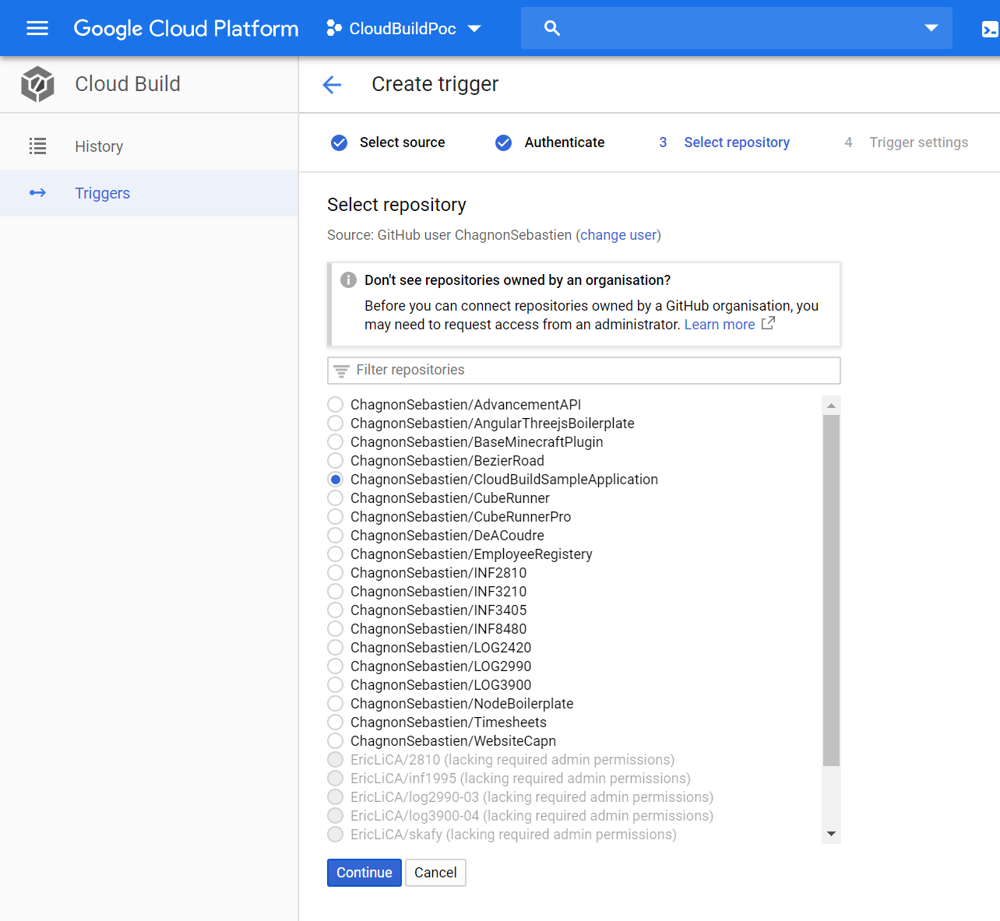
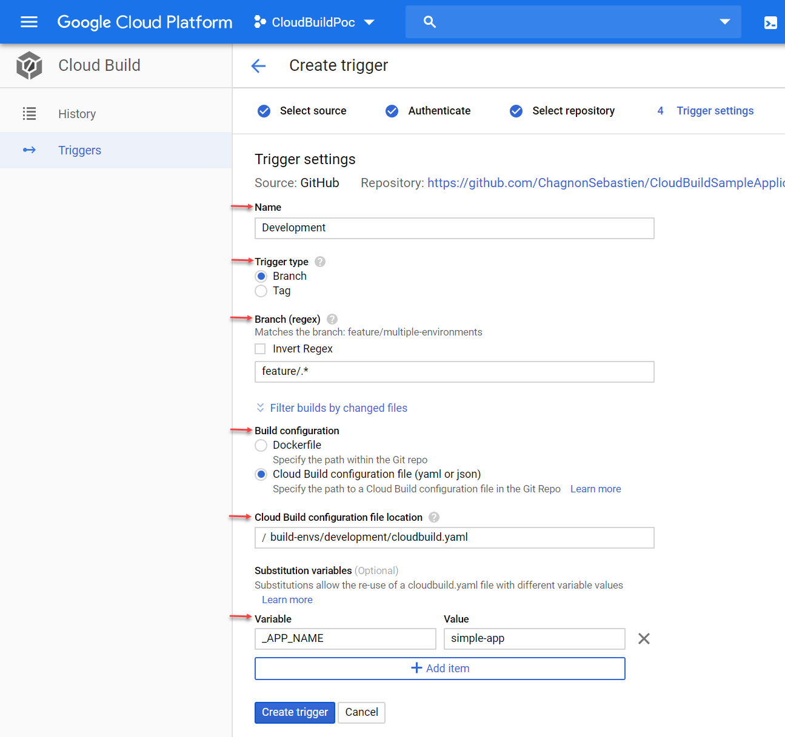
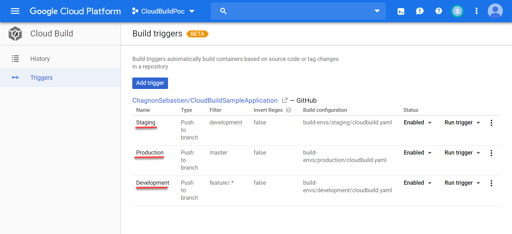

# Cloud Build Sample Application
This project is a sample of a project using Google's Cloud Build. It packages a simple Hello-World application in a Docker image, and pushes the image in Google Container Registery for you to deploy it.

## Environments setup
The three main environments of GitFlow are provided in this sample project: **development**, **staging** and **production**. You may add or remove environments as you like.
A simple cloudbuild.yaml is provided for each of those environments in `/build-envs`. Each of those files should be linked to a diffrerent trigger in your cloudbuild config.
See the [Create Trigger](#createtrigger) section for an in-depth view of triggers creation.

## Substitution Variables
The following substitution variable must be set when triggering each build:
- _APP_NAME: "my-application-name"
See the [Create Trigger](#createtrigger) section for an in-depth view of triggers creation.

## Build artefacts
The following images will be created in GCR:
- gcr.io/{{project-name}}/{{environment}}/{{application-name}}:latest
- gcr.io/{{project-name}}/{{environment}}/{{application-name}}:{major_version}
- gcr.io/{{project-name}}/{{environment}}/{{application-name}}:{major_version}.{minor_version}
- gcr.io/{{project-name}}/{{environment}}/{{application-name}}:{major_version}.{minor_version}.{build_number}
- gcr.io/{{project-name}}/{{environment}}/{{application-name}}:{major_version}.{minor_version}.{build_number}-{build_id}

## Create trigger on the Google Cloud Plateform
1. In Google Cloud Plateform, enter the **Cloud Build** section via the hamburger menu
2. Select the **Triggers** section in the left menu
3. Click **Add trigger**

4. Select your Source Code plateform 
5. Consent to Google collecting and storing  your auth tocken 

6. Select this repository

7. Name your trigger (I use the environment name)
8. Set trigger type to **branch**
9. Set the branch regex to select which branch fit in this environment
10. Set build configuration to **Cloud Build Configuration File**
11. Specify the location of the configuration file from the root of the project
12. Set the necessary Substitution variables (see the [Substitution Variables](#substitutionvariables) section for details)

13. Repeat for all environments
